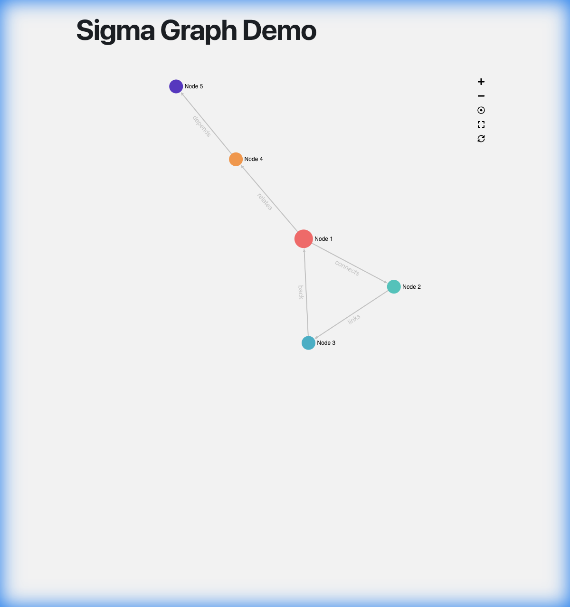

# Reflex Sigma Graph

A Sigma.js graph visualization component for [Reflex](https://reflex.dev), enabling interactive network graph visualizations in your Reflex applications.



## Features

- 🎨 Interactive graph visualization with Sigma.js
- 📊 Multiple layout algorithms (ForceAtlas2, Circular, Random)
- 🎯 Node and edge interactions (hover, click events)
- 🏷️ Customizable node and edge labels
- 🎨 Flexible styling and theming
- 📈 Support for large graphs with efficient rendering
- 🔄 Real-time graph updates

## Installation

> **Tip:** We recommend using [uv](https://github.com/astral-sh/uv) for faster installation and better dependency management.

### From PyPI

**With uv (recommended - faster):**
```bash
uv pip install reflex-sigma-graph
```

**With pip:**
```bash
pip install reflex-sigma-graph
```

### Development Installation (Current)

For now, install directly from the repository:

**With uv (recommended - faster):**
```bash
# Clone the repository
git clone https://github.com/yrangana/reflex-sigma-graph.git
cd reflex-sigma-graph

# Create virtual environment and install
uv venv
source .venv/bin/activate  # On Windows: .venv\Scripts\activate
uv pip install -e .
```

**With pip:**
```bash
# Clone the repository
git clone https://github.com/yrangana/reflex-sigma-graph.git
cd reflex-sigma-graph

# Create virtual environment and install
python -m venv .venv
source .venv/bin/activate  # On Windows: .venv\Scripts\activate
pip install -e .
```

### Frontend Dependencies

Add the required npm packages to your app's `rxconfig.py`:

```python
import reflex as rx

config = rx.Config(
    app_name="your_app",
    frontend_packages=[
        "@react-sigma/core@5.0.4",
        "@sigma/edge-curve@3.1.0",
        "sigma@3.0.2",
        "graphology@0.26.0",
        "graphology-layout-forceatlas2@0.10.1",
        "graphology-layout-noverlap@0.4.2",
        "graphology-shortest-path@2.0.2",
    ]
)
```

Reflex will automatically install these packages when you run `reflex run`.

## Quick Start

```python
import reflex as rx
from reflex_sigma_graph import sigma_graph_viewer

def index():
    # Sample graph data
    graph_data = {
        "nodes": [
            {"id": "n1", "label": "Node 1", "size": 10, "x": 0, "y": 0, "color": "#1f77b4"},
            {"id": "n2", "label": "Node 2", "size": 15, "x": 1, "y": 1, "color": "#ff7f0e"},
            {"id": "n3", "label": "Node 3", "size": 12, "x": -1, "y": 0.5, "color": "#2ca02c"}
        ],
        "edges": [
            {"source": "n1", "target": "n2", "label": "connects to"},
            {"source": "n2", "target": "n3", "label": "links"}
        ]
    }
    
    return rx.center(
        rx.vstack(
            rx.heading("My Graph Visualization", size="9"),
            sigma_graph_viewer(
                graph_data=graph_data,
                layout_type="forceAtlas2",
                show_node_labels=True,
                show_edge_labels=True,
                style={"width": "100%", "height": "600px", "border": "1px solid #ddd"}
            ),
            width="80%",
            spacing="4"
        )
    )

app = rx.App()
app.add_page(index)
```

## Graph Data Format

The component accepts graph data in a simple format:

```python
{
    "nodes": [
        {
            "id": "unique_id",      # Required: string
            "label": "Node Label",  # Optional: string
            "size": 10,            # Optional: number (default: 5)
            "x": 0,                # Optional: number
            "y": 0,                # Optional: number
            "color": "#ff0000"     # Optional: hex color
        }
    ],
    "edges": [
        {
            "source": "node_id_1", # Required: source node id
            "target": "node_id_2", # Required: target node id
            "label": "Edge Label", # Optional: string
            "color": "#00ff00"     # Optional: hex color
        }
    ]
}
```

## Configuration Options

### Layout Types
- `"forceAtlas2"`: Physics-based force-directed layout (default)
- `"circular"`: Arranges nodes in a circle
- `"random"`: Random positioning
- `"noverlap"`: Prevents node overlapping

### Props

| Prop | Type | Default | Description |
|------|------|---------|-------------|
| `graph_data` | dict | `{}` | Graph data with nodes and edges |
| `layout_type` | str | `"forceAtlas2"` | Layout algorithm to use |
| `show_node_labels` | bool | `True` | Display node labels |
| `show_edge_labels` | bool | `False` | Display edge labels |
| `layout_running` | bool | `False` | Whether layout is actively running |
| `drag_neighbors` | bool | `False` | Drag connected nodes together |
| `edge_type` | str | `"arrow"` | Edge style: "arrow", "line", "curve" |
| `theme` | str | `"light"` | Theme: "light", "dark", or "custom" |
| `style` | dict | `{"width": "100%", "height": "600px"}` | Container styles |

### Event Handlers

```python
def handle_node_click(node_id, node_data):
    print(f"Clicked node: {node_id}")
    print(f"Node data: {node_data}")

sigma_graph_viewer(
    graph_data=data,
    on_node_click=handle_node_click,
    on_node_hover=handle_node_hover,
    on_edge_click=handle_edge_click
)
```

Available events:
- `on_node_click`: Triggered when a node is clicked
- `on_node_hover`: Triggered when hovering over a node
- `on_edge_click`: Triggered when an edge is clicked
- `on_edge_hover`: Triggered when hovering over an edge
- `on_layout_complete`: Triggered when layout computation finishes

## Advanced Example with State

```python
import reflex as rx
from reflex_sigma_graph import sigma_graph_viewer

class GraphState(rx.State):
    selected_node: str = ""
    
    def handle_node_click(self, node_id: str, node_data: dict):
        self.selected_node = node_id
        print(f"Selected: {node_id}")

def index():
    return rx.vstack(
        sigma_graph_viewer(
            graph_data=GraphState.graph_data,
            on_node_click=GraphState.handle_node_click,
            layout_type="forceAtlas2",
            style={"width": "100%", "height": "500px"}
        ),
        rx.text(f"Selected node: {GraphState.selected_node}")
    )
```

## Troubleshooting

### Graph not rendering
1. Ensure `frontend_packages` are configured in your `rxconfig.py`
2. Check browser console for errors
3. Verify graph data format is correct

### Layout not working
- Try setting `layout_running=True` to activate the layout
- Different layouts work better for different graph structures

### Performance issues
- For large graphs (>1000 nodes), consider:
  - Using simpler layouts
  - Reducing node/edge label display
  - Implementing pagination or filtering

## Contributing

Contributions are welcome! Please feel free to submit a Pull Request.

## License

MIT License

## Links

- [Sigma.js Documentation](https://www.sigmajs.org/)
- [Reflex Documentation](https://reflex.dev/docs)
- [GitHub Repository](https://github.com/yrangana/reflex-sigma-graph)
